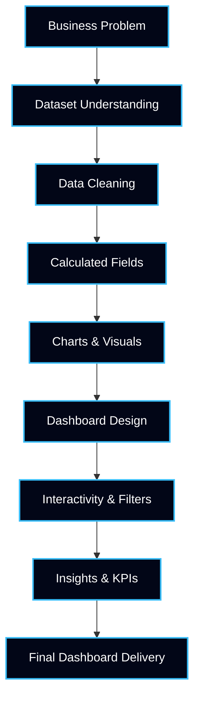

<!-- ========================================================= -->
<!-- ========== TABLEAU ADVANCE PROJECTS PORTFOLIO ============ -->
<!-- ========================================================= -->

<p align="center">
  
</p>

<h1 align="center">📊 15 Tableau Advance Projects</h1>

<p align="center">
<b>Industry-Ready Business Intelligence & Data Visualization Portfolio</b><br>
Showcasing <b>advanced Tableau dashboards, analytics storytelling, and decision-driven insights</b>
</p>

---

## 📌 Repository Overview

```txt
Domain           : Business Intelligence & Data Visualization
Tool             : Tableau (Advanced Level)
Total Projects   : 15
Focus Area       : Dashboards | KPIs | Analytics | Storytelling
Approach         : Hands-on | Business-Oriented | Portfolio-Ready
Outcome          : Job-Ready Tableau & BI Profile
````

This repository contains **15 advanced Tableau projects** designed to reflect:

* Real-world business problems
* Interactive dashboards & reports
* KPI-driven analysis
* Data storytelling for stakeholders
* Professional visualization standards

---

## 🔥 Repository Metrics
📡 Live Repository Activity (Real-Time)
<p align="center">     </p> <p align="center"> 📊 <b>Live GitHub statistics automatically update based on real user interaction</b> </p>
🔗 Share & Promote This Portfolio
<p align="center"> <a href="https://www.linkedin.com/sharing/share-offsite/?url=https://github.com/Ashwin18-Offcl/15_Tableau_Advance_Project">  </a> <a href="https://twitter.com/intent/tweet?url=https://github.com/Ashwin18-Offcl/15_Tableau_Advance_Project&text=15%20Advanced%20Tableau%20Projects%20Portfolio">  </a> <a href="https://wa.me/?text=Check%20out%20this%20Advanced%20Tableau%20Portfolio:%20https://github.com/Ashwin18-Offcl/15_Tableau_Advance_Project">  </a> </p> <p align="center"> <b>💡 Designed for instant recruiter, mentor & peer sharing</b> </p>

## 🎯 Project Objectives (Industry-Aligned)

* Build **interactive Tableau dashboards**
* Design **executive-level KPI reports**
* Perform **data analysis & trend identification**
* Apply **best practices in data visualization**
* Convert raw data into **business insights**
* Create **portfolio-ready BI solutions**

---

## 🧠 Tableau Skills Mapped to Industry Expectations

| Industry Requirement      | Tableau Skill Applied         |
| ------------------------- | ----------------------------- |
| Business Understanding    | KPI & Metric Design           |
| Clean Visualization       | Dashboard Layout & UX         |
| Analytical Thinking       | Trend & Pattern Analysis      |
| Interactivity             | Filters, Actions & Parameters |
| Performance Optimization  | Extracts & Calculated Fields  |
| Stakeholder Communication | Data Storytelling             |

---

## 📦 Tableau Project Lifecycle



---

## 🧭 Tableau Learning Roadmap

```mermaid
flowchart LR

    A[Data Understanding]:::basic --> B[Data Cleaning]:::basic
    B --> C[Calculated Fields]:::intermediate
    C --> D[Charts & Graphs]:::intermediate
    D --> E[Dashboard Design]:::advanced
    E --> F[Filters & Actions]:::advanced
    F --> G[Storytelling]:::deploy
    G --> H[Business Insights]:::deploy

    classDef basic fill:#ecfeff,color:#020617,stroke:#06b6d4,stroke-width:2px
    classDef intermediate fill:#fef3c7,color:#78350f,stroke:#f59e0b,stroke-width:2px
    classDef advanced fill:#ede9fe,color:#4c1d95,stroke:#8b5cf6,stroke-width:2px
    classDef deploy fill:#dcfce7,color:#14532d,stroke:#22c55e,stroke-width:2px
```



---

## 🧪 Typical Tableau Project Structure

```txt
📁 Project_Name/
│
├── 📊 dataset.csv / dataset.xlsx
├── 📈 dashboard.twb / .twbx
├── 🖼️ dashboard_screenshot.png
├── 📄 problem_statement.md
├── 📋 insights.md
└── 📑 README.md
```

---

## 📊 Visualization Techniques Used

* Bar, Line & Area Charts
* KPI Cards
* Heatmaps
* Geographic Maps
* Trend & Forecast Analysis
* Comparative Dashboards
* Drill-down & Drill-through

---

## 🧠 Advanced Tableau Features Used

* Calculated Fields
* Table Calculations
* Parameters
* Filters & Dashboard Actions
* Hierarchies
* Date & Time Intelligence
* Performance Optimization

---

## 📈 Business KPIs & Metrics

| Category      | Example Metrics           |
| ------------- | ------------------------- |
| Sales         | Revenue, Growth %, Profit |
| Customer      | Retention, Churn          |
| Operations    | Efficiency, Cost Analysis |
| Time Analysis | MoM, YoY Trends           |
| Geography     | Region-wise Performance   |

---

## 🛠️ Tools & Technology Stack

| Tool    | Usage                       |
| ------- | --------------------------- |
| Tableau | Dashboards & BI Reporting   |
| Excel   | Data Cleaning & Preparation |
| CSV     | Dataset Storage             |
| GitHub  | Version Control & Portfolio |

---

## 🧑‍💻 Author

**Ashwin Ananta Panbude**
Data Analyst | BI Developer | Faculty

<p align="center">
  <a href="https://github.com/Ashwin18-Offcl">
    
  </a>
  <a href="https://bit.ly/49pSuZJ">
    
  </a>
</p>

---

## 📝 Summary

This repository demonstrates **advanced Tableau expertise** through **15 real-world projects** focused on **business intelligence, data visualization, KPI analysis, and storytelling**.
Built to meet **industry expectations** and support **data analyst & BI developer roles**.


